## Planejamento e Execução dos Cenários de Teste

### CT-LOG-01: Login com credenciais válidas

| Campo | Descrição |
|---|---|
| **Objetivo** | Validar que um usuário com credenciais válidas consegue autenticar-se e acessar a tela principal do sistema. |
| **Pré-Condições** | Usuário previamente cadastrado (credenciais fornecidas no desafio); sistema acessível pela URL do desafio. |
| **Dados Utilizados** | E-mail: logap@teste.com Senha: a informada no documento do desafio |
| **Passos** | 1. Abrir a URL da aplicação; 2. Verificar que a tela de login é exibida; 3. Preencher o campo "E-mail" com o e-mail informado; 4. Preencher o campo "Senha" com a senha informada; 5. Clicar no botão "Entrar"; |
| **Resultado Esperado** | O sistema autentica o usuário e redireciona para o Dashboard, exibindo o nome e o e-mail do usuário no cabeçalho e os indicadores carregados, sem mensagens de erro. |
| **Resultado Obtido** | O sistema autenticou o usuário e redirecionou para o Dashboard. O cabeçalho exibiu o usuário logado e os cards (Total de KM, Volume por Categoria, Cronograma de Manutenção, Ranking de Utilização e Projeção Financeira) foram carregados, sem mensagens de erro. |
| **Status** | Aprovado |
| **Evidências** | 1.  2. 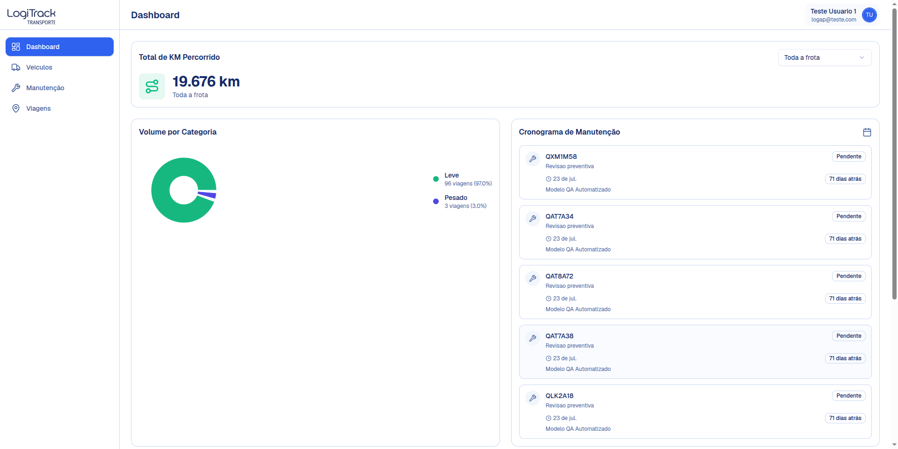 |

### CT-LOG-02: Login com e-mail correto e senha inválida

| Campo | Descrição |
|---|---|
| **Objetivo** | Validar que um usuário com senha inválida não consegue autenticar-se e acessar a tela principal do sistema. |
| **Pré-Condições** | Usuário previamente cadastrado (credenciais fornecidas no desafio); sistema acessível pela URL do desafio. |
| **Dados Utilizados** | E-mail: logap@teste.com Senha: 123456 |
| **Passos** | 1. Abrir a URL da aplicação; 2. Verificar que a tela de login é exibida; 3. Preencher o campo "E-mail" com o e-mail informado; 4. Preencher o campo "Senha" com a senha inválida; 5. Clicar no botão "Entrar"; |
| **Resultado Esperado** | O sistema não autentica o usuário e aparece uma mensagem de erro informando ao usuário que uma das suas credenciais estão incorretas. |
| **Resultado Obtido** | O sistema autenticou o usuário e redirecionou para o Dashboard. Não apareceu nenhuma mensagem de erro. A requisição de login retornou status 200. |
| **Status** | Reprovado. |
| **Evidências** | 1.  2.  |

### CT-LOG-03: Login com e-mail inexistente

| Campo | Descrição |
|---|---|
| **Objetivo** | Validar que um usuário com e-mail não cadastrado não consegue autenticar-se nem acessar a tela principal do sistema. |
| **Pré-Condições** | Usuário com e-mail não cadastrado no sistema. |
| **Dados Utilizados** | E-mail: teste@gmail.com Senha: abcdef |
| **Passos** | 1. Abrir a URL da aplicação; 2. Verificar que a tela de login está exibida; 3. Preencher o campo “E-mail” com algum e-mail não cadastrado no sistema; 4. Preencher o campo “Senha” com a senha inválida; 5. Clicar no botão “Entrar”; |
| **Resultado Esperado** | O sistema não autentica o usuário e aparece uma mensagem de erro informando ao usuário que uma das suas credenciais estão incorretas. |
| **Resultado Obtido** | O sistema não autenticou o usuário e apareceu uma mensagem de erro: “Invalid email or password”. |
| **Status** | Aprovado. |
| **Evidências** | 1.  2. 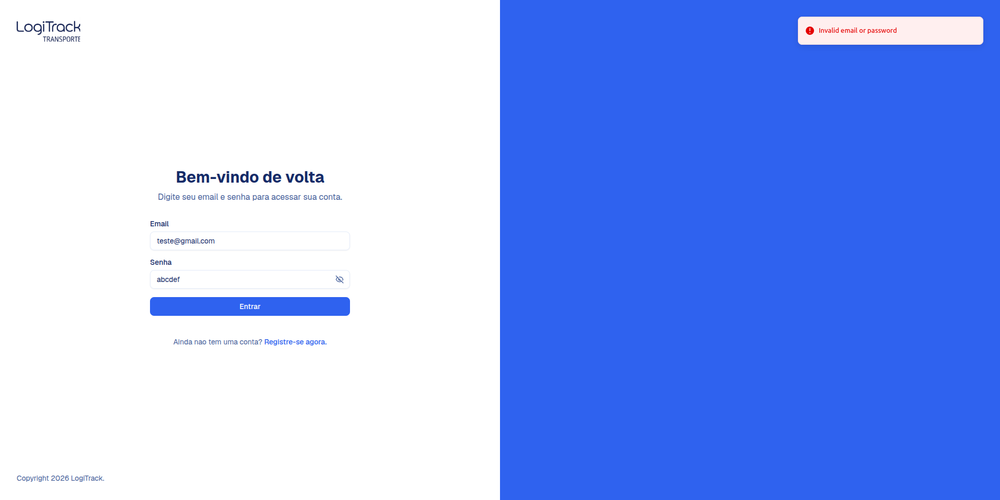 |

### CT-CAD-01: Cadastro com e-mail já existente

| Campo | Descrição |
|---|---|
| **Objetivo** | Validar que o usuário não consegue se cadastrar com um e-mail já existente no sistema. |
| **Pré-Condições** | Usuário com e-mail já cadastrado no sistema. |
| **Dados Utilizados** | Nome: Eduardo Teste E-mail: logap@teste.com Senha: 12345678 |
| **Passos** | 1. Abrir a URL da aplicação; 2. Acessar a tela de cadastro; 3. Preencher os campos: Nome, E-mail (com e-mail já cadastrado) e Senha. 4. Clicar no botão “Criar Conta”; |
| **Resultado Esperado** | O sistema não realiza o cadastro no sistema e aparece uma mensagem de erro informando que o e-mail já está sendo utilizado. |
| **Resultado Obtido** | O sistema não realizou o cadastro no sistema e apareceu uma mensagem de erro: “User with email ‘logap@teste.com’ already exists.”. |
| **Status** | Aprovado |
| **Evidência** | 1.  2. 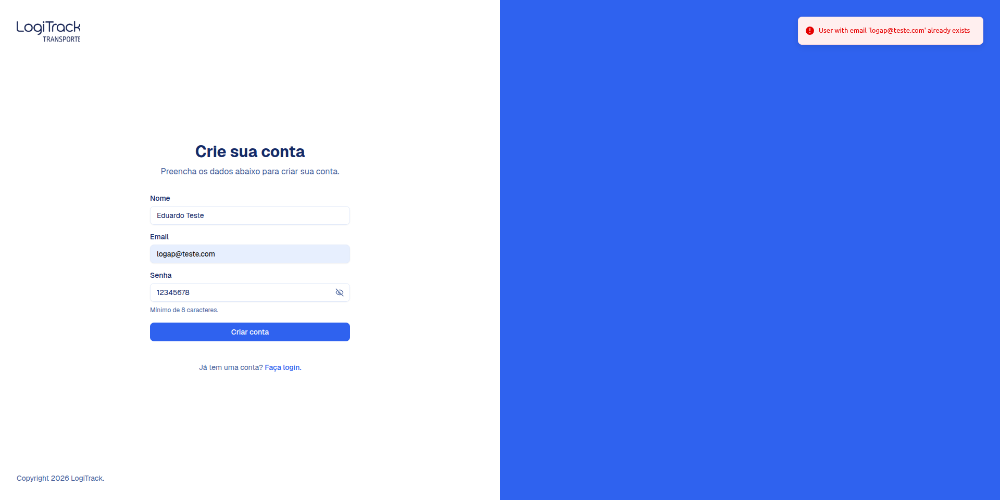 |

### CT-CAD-02: Cadastro de usuário

| Campo | Descrição |
|---|---|
| **Objetivo** | Registrar e autenticar o indivíduo no sistema. |
| **Pré-Condições** | Usuário ter acesso a tela de cadastro. |
| **Dados Utilizados** | Nome: Eduardo Teste E-mail: eduardoteste@gmail.com Senha: 12345678 |
| **Passos** | 1. Abrir a URL da aplicação; 2. Acessar a tela de cadastro; 3. Preencher os campos: Nome, E-mail (com e-mail já cadastrado) e Senha (no mínimo 8 caracteres). 4. Clicar no botão “Criar Conta”; |
| **Resultado Esperado** | O sistema realiza o cadastro no sistema e aparece uma mensagem de confirmação. |
| **Resultado Obtido** | O sistema realizou o cadastro e direcionou automaticamente o usuário para a tela principal. |
| **Status** | Aprovado. |
| **Evidência** | 1.  2. 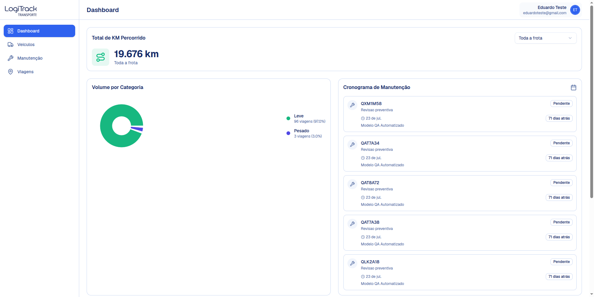 |

### CT-DASH-01: Filtro de KM por veículo

| Campo | Descrição |
|---|---|
| **Objetivo** | Validar se o card de ‘Total de KM Percorrido’ atualiza corretamente os dados ao selecionar um veículo específico no filtro. |
| **Pré-Condições** | O usuário deve estar autenticado no sistema com perfil de acesso válido. O usuário deve estar na tela do dashboard. O sistema deve possuir veículos cadastrados com registros de quilometragem prévia. |
| **Dados Utilizados** | Opção padrão: ‘Toda a frota’. Opção Teste: ADF-1565 - Gol |
| **Passos** | 1. Acessar o sistema e navegar até a tela principal (dashboard); 2. Localizar o card de métricas ‘Total de KM Percorrido’. 3. Clicar no campo de seleção localizado no canto superior direito do card, exibindo ‘Toda Frota’; 4. Selecionar um veículo específico na lista suspensa; |
| **Resultado Esperado** | O menu deve listar todos os veículos ativos da frota e ao selecionar o veículo, o valor numérico de quilometragem no card deve ser atualizado instantaneamente para o total percorrido por aquele veículo específico. Além disso, o subtítulo deve exibir a placa do veículo selecionado. |
| **Resultado Obtido** | O valor de KM foi atualizado corretamente para o veículo selecionado e a interface exibiu a mudança de escopo. |
| **Status** | Aprovado |
| **Evidência** | 1. 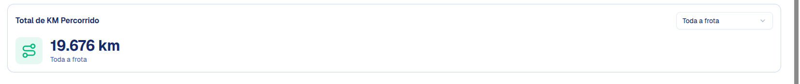 2. 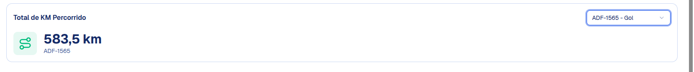 |

### CT-DASH-02: Acesso ao dashboard sem login

| Campo | Descrição |
|---|---|
| **Objetivo** | Garantir a segurança da aplicação verificando se o sistema impede o acesso não autorizado à tela principal. |
| **Pré-Condições** | O usuário não deve possuir uma sessão ativa no sistema (não estar logado). O navegador não deve conter cookies ou tokens de autenticação válidos salvos em cache. |
| **Dados Utilizados** | URL de acesso direto ao dashboard: https://logitrack.danieldiegosantana.me/dashboard |
| **Passos** | 1. Abrir o navegador web na aba anônima; 2. Copiar e colar a URL direta do dashboard na barra de endereços do navegador (https://logitrack.danieldiegosantana.me/dashboard). 3. Pressionar "Enter" para tentar carregar a página. |
| **Resultado Esperado** | O sistema deve bloquear a renderização dos dados e da interface do dashboard e o usuário deve ser redirecionado imediatamente para a tela de autenticação. |
| **Resultado Obtido** | O sistema bloqueou e direcionou o usuário para a tela de autenticação (login). |
| **Status** | Aprovado. |
| **Evidência** | 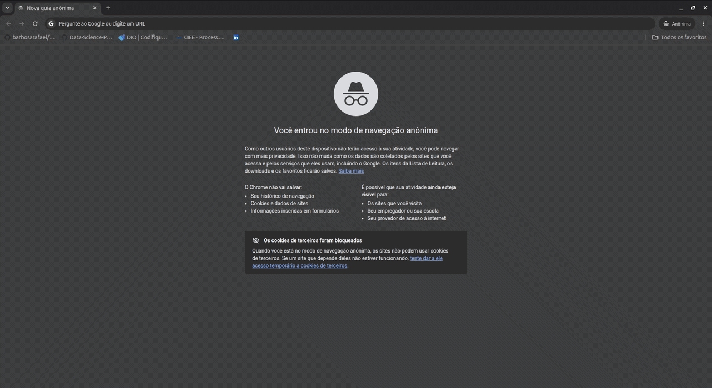 |

### CT-VEI-01: Buscar veículo por placa

| Campo | Descrição |
|---|---|
| **Objetivo** | Verificar se o campo de busca filtra a lista corretamente quando a gente digita a placa de um veículo que já está cadastrado. |
| **Pré-Condições** | O usuário precisa estar logado e na tela de ‘Veículos’. A tabela precisa ter dados cadastrados. |
| **Dados Utilizados** | Placa do veículo que está na tabela, ADF-1562. |
| **Passos** | 1. Acesse a página de Veículos. 2. Clique na barra de pesquisa que diz "Buscar por placa, modelo...". 3. Digite a placa escolhida (ex: ADF-1565). |
| **Resultado Esperado** | A tabela deve ser atualizada para mostrar apenas a linha do veículo com essa placa exata e todos os outros veículos da lista devem sumir da tela. |
| **Resultado Obtido** | A tabela exibiu somente os dados do veículo que foi filtrado pela placa. |
| **Status** | Aprovado |
| **Evidência** | [CT-VEI-01_1_busca_por_placa.pdf](../evidencias/cenarios/CT-VEI-01_1_busca_por_placa.pdf) |

### CT-VEI-02: Cadastro com placa duplicada

| Campo | Descrição |
|---|---|
| **Objetivo** | Garantir que o sistema não permita o cadastro de dois veículos com a mesma placa, evitando dados duplicados na base. |
| **Pré-Condições** | O usuário precisa estar logado e na tela de "Veículos". Já deve existir pelo menos um veículo cadastrado na lista. |
| **Dados Utilizados** | Uma placa que já está em uso na tabela (ADF-1565). |
| **Passos** | 1. Clicar no botão "+ Adicionar Veículo" no canto direito da tela. 2. Preencher o formulário de cadastro, inserindo no campo de placa aquela que já existe no sistema. 3. Preencher os demais campos e clicar no botão ‘Criar’. |
| **Resultado Esperado** | O sistema deve bloquear o cadastro e não salvar o novo veículo e aparecer uma mensagem de erro. |
| **Resultado Obtido** | O sistema bloqueou o cadastro e apareceu mensagem de erro: ‘Veiculo with placa ‘ADF-1565’ already exists’. |
| **Status** | Aprovado. |
| **Evidência** | 1. 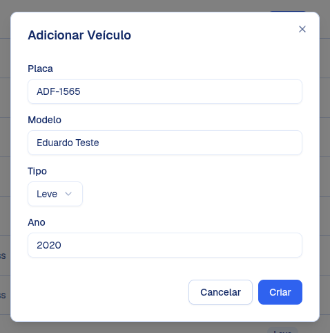 2. 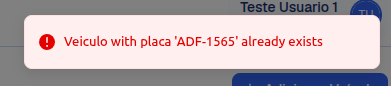 |

### CT-VEI-03: Cadastro com ano inválido

| Campo | Descrição |
|---|---|
| **Objetivo** | Verificar se o sistema faz a validação correta do campo "Ano" no momento do cadastro. |
| **Pré-Condições** | O usuário precisa estar logado e na tela de "Veículos". |
| **Dados Utilizados** | Dados válidos para Placa, Modelo e Tipo. Um dado inválido para o campo Ano (ex.: 3000). |
| **Passos** | 1. Clicar no botão "+ Adicionar Veículo". 2. Preencher os campos do formulário. 3. No campo "Ano", digitar um valor inválido (ex: 3000). 4. Clicar no botão “Criar”. |
| **Resultado Esperado** | O sistema não deve permitir que o cadastro seja concluído e apareça uma mensagem de erro. |
| **Resultado Obtido** | O sistema cadastrou o veículo com ano inválido e apareceu uma mensagem de confirmação. |
| **Status** | Reprovado. |
| **Evidência** | 1. 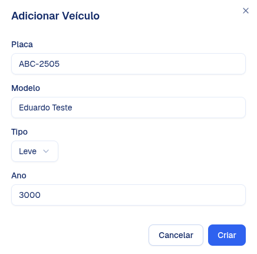 2. 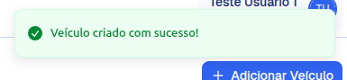 |

### CT-MAN-01: Cadastro com ano inválido

| Campo | Descrição |
|---|---|
| **Objetivo** | Verificar se o sistema valida corretamente o ano inserido nos campos de data ao criar um novo registro de manutenção, impedindo anos absurdos (muito no passado ou muito no futuro). |
| **Pré-Condição** | O usuário precisa estar logado e ter navegado até a tela de "Manutenção". |
| **Dados Utilizados** | Dados válidos para Veículo, Serviço, Custo Est. e Status. Uma data com ano inválido para "Data Início" ou "Finalização (ex.: 1800 e 3500). |
| **Passos** | 1. Clicar no botão "+ Nova Manutenção". 2. Preencher os campos de veículo, serviço e custo estimado com informações válidas. 3. No campo de "Data Início" ou "Finalização", digitar uma data contendo um ano inválido (ex: 01/01/3000). 4. Clicar no botão para “Criar”. |
| **Resultado Esperado** | O sistema deve impedir que a manutenção seja salva. Uma mensagem de erro deve aparecer alertando que o ano ou a data inserida não é permitida. |
| **Resultado Obtido** | O sistema não impediu que a manutenção fosse salva e apareceu uma mensagem de confirmação de manutenção. |
| **Status** | Reprovado. |
| **Evidência** | 1. 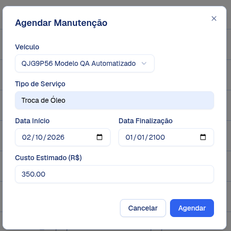 2. 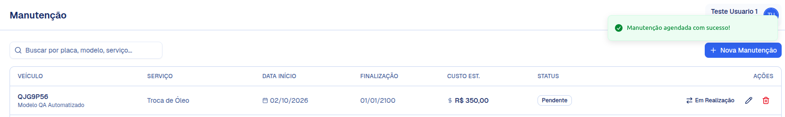 |

### CT-MAN-02: Custo inválido (zero, negativo, texto)

| Campo | Descrição |
|---|---|
| **Objetivo** | Validar o sistema ao tentar inserir dados incorretos no campo de custo da manutenção, garantindo que o sistema aceite apenas valores monetários positivos e válidos. |
| **Pré-Condição** | O usuário precisa estar logado e ter navegado até a tela de "Manutenção". |
| **Dados Utilizados** | Dados sobre: Veículos, Serviço, Datas e Status; Três variações de dados inválidos para o campo "Custo Est.": Valor zero, negativo e caracteres. |
| **Passos** | 1. Clicar no botão "+ Nova Manutenção". 2. Preencher as informações do veículo, tipo de serviço e datas com dados válidos. 3. No campo "Custo Est.", inserir o valor zero. 4. Tentar salvar a manutenção. 5. Repetir o processo inserindo um valor negativo no custo. 6. Repetir o processo tentando digitar letras ou símbolos no campo de custo. |
| **Resultado Esperado** | O sistema deve bloquear a ação de salvar em todos os três casos. Para o teste com caracteres, o campo deve bloquear a digitação ou alertar que o formato é inválido. E para os testes com valor zero ou negativo exibir uma mensagem de erro. |
| **Resultado Obtido** | O sistema bloqueou a digitação de letras e impediu o salvamento com valores zero ou negativos, exibindo os alertas na tela. |
| **Status** | Aprovado. |
| **Evidência** | 1.  2.  3. 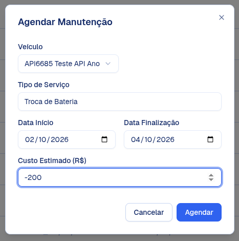 4.  |

### CT-MAN-03: Status de Pendente para Em Realização

| Campo | Descrição |
|---|---|
| **Objetivo** | Validar se o sistema permite alterar corretamente o status de uma manutenção que está como "Pendente" para "Em Realização". |
| **Pré-Condição** | O usuário precisa estar logado e na tela "Manutenção". Deve existir pelo menos um registro de manutenção na tabela com o STATUS constando como "Pendente". |
| **Dados Utilizados** | Um registro existente com status "Pendente". |
| **Passos** | 1. Acessar a tela de “Manutenção”. 2. Localizar na tabela um registro que esteja com a tag "Pendente" na coluna STATUS. 3. Na coluna "AÇÕES" dessa mesma linha, clicar no botão de ação escrito "Em Realização". 4. Caso o sistema exiba um modal de confirmação, confirmar a ação. |
| **Resultado Esperado** | O sistema deve processar a mudança e exibir uma mensagem de sucesso. A tag na coluna STATUS daquele registro deve mudar imediatamente de "Pendente" para “Em Realização”. |
| **Resultado Obtido** | Ao clicar no botão, o status do registro foi atualizado corretamente na tabela e a ação de "Em Realização" muda para “Concluída”. |
| **Status** | Aprovado. |
| **Evidência** | 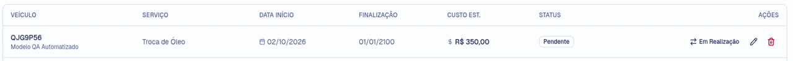 |

### CT-VIA-01: Chegada anterior à saída

| Campo | Descrição |
|---|---|
| **Objetivo** | Validar se o sistema impede o cadastro de uma nova viagem quando a "Data Chegada" informada é anterior à "Data Saída". |
| **Pré-Condição** | O usuário deve estar logado e com a tela de "Viagens" aberta. |
| **Dados Utilizados** | Valores válidos para os campos Veículo, Origem, Destino e Quilometragem Percorrida (KM). Uma "Data Saída" específica (ex: 10/09/2026). Uma "Data Chegada" que seja anterior à data de saída (ex: 09/09/2026). |
| **Passos** | 1. Na tela de Viagens, clicar no botão "+ Nova Viagem"; 2. No modal "Adicionar Viagem", selecionar um veículo e preencher a Origem, Destino e Quilometragem com dados quaisquer. 3. No campo "Data Saída", inserir a data escolhida; 4. No campo "Data Chegada", inserir uma data anterior à data de saída; 5. Clicar no botão “Adicionar” para salvar; |
| **Resultado Esperado** | O sistema não deve permitir o cadastro da viagem. O modal deve continuar aberto e a tela deve exibir uma mensagem de erro. |
| **Resultado Obtido** | O sistema permitiu o cadastro da viagem e apareceu uma mensagem de confirmação: “Viagem agendada com sucesso”. |
| **Status** | Reprovado. |
| **Evidência** | 1. 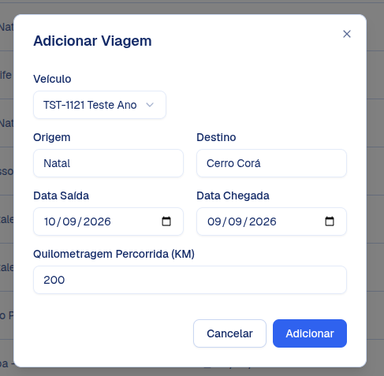 2. 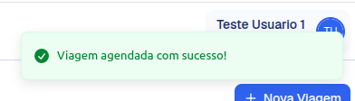 |

### CT-VIA-02: KM negativo

| Campo | Descrição |
|---|---|
| **Objetivo** | Validar se o sistema bloqueia o cadastro de uma nova viagem caso o usuário informe um valor negativo no campo "Quilometragem Percorrida (KM)". |
| **Pré-Condição** | O usuário precisa estar autenticado e na tela de "Viagens". |
| **Dados Utilizados** | Informações válidas para Veículo, Origem, Destino, Data Saída e Data Chegada. Um valor negativo para o campo de quilometragem (ex: -200). |
| **Passos** | 1. Clicar no botão “+ Nova Viagem”; 2. No modal "Adicionar Viagem", selecionar um veículo e preencher a Origem, Destino e as Datas com dados válidos; 3. No campo "Quilometragem Percorrida (KM)", digitar um valor negativo; 4. Clicar no botão "Adicionar" para tentar salvar o registro. |
| **Resultados Esperados** | O sistema não deve processar o cadastro da viagem. A tela deve sinalizar um erro, exibindo uma mensagem informando que o valor deve ser maior que zero |
| **Resultados Obtidos** | O sistema processa o cadastro da viagem mesmo com o valor da quilometragem sendo negativo, exibindo uma mensagem de confirmação: “Viagem agendada com sucesso”. |
| **Status** | Reprovado |
| **Evidências** | 1. 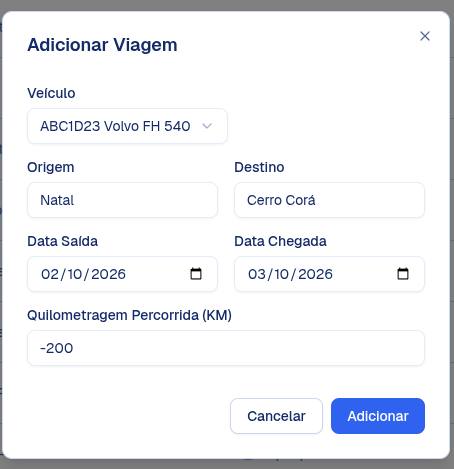 2. 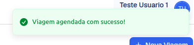 |

### CT-VIA-03: Trajetos sobrepostos no mesmo veículo

| Campo | Descrição |
|---|---|
| **Objetivo** | Verificar se o sistema impede o cadastro de uma nova viagem para um veículo que já possui outra viagem registrada no mesmo período. |
| **Pré-Condição** | O usuário deve estar autenticado e na tela de "Viagens". Deve existir previamente pelo menos uma viagem cadastrada para um veículo específico. |
| **Dados Utilizados** | O mesmo veículo que já possui uma viagem cadastrada (ex.: o veículo ADF-1565 que já tem uma viagem entre 29/09/2026 e 30/09/2026). Dados de Origem, Destino e KM preenchidos com novas informações. Datas de Saída e Chegada que entrem em conflito com a viagem já existente (ex: Saída em 29/09/2026 e Chegada em 30/09/2026). |
| **Passos** | 1. Clicar no botão "+ Nova Viagem"; 2. No modal "Adicionar Viagem", selecionar o veículo que já está em uso naqueles dias; 3. Preencher a Origem, Destino e Quilometragem; 4. Preencher as datas de Saída e Chegada com o período que se sobrepõe à viagem já existente. 5. Clicar no botão "Adicionar" para tentar salvar. |
| **Resultados Esperados** | O sistema deve bloquear a criação da viagem. Uma mensagem de erro deve alertar o usuário que o veículo já está alocado para outro trajeto. |
| **Resultados Obtidos** | O sistema não bloqueou a criação da viagem, exibindo uma mensagem de confirmação: “Viagem agendada com sucesso”. |
| **Status** | Reprovado. |
| **Evidências** | 1. 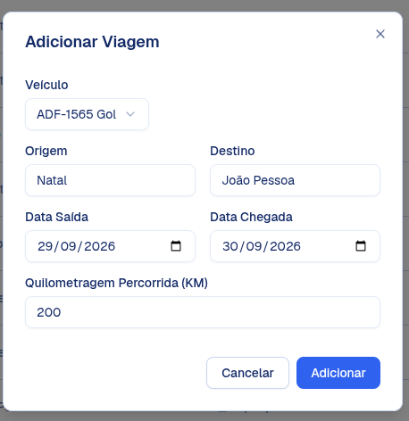 2. 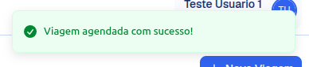 |

### CT-INT-01: Viagem criada reflete no Total de KM

| Campo | Descrição |
|---|---|
| **Objetivo** | Validar a integração entre os módulos de Viagens e Dashboard, garantindo que, ao cadastrar uma nova viagem, o valor da quilometragem seja somado corretamente ao indicador geral de "Total de KM Percorrido" na tela principal. |
| **Pré-Condição** | O usuário precisa estar logado no sistema. É necessário anotar o valor atual que consta no card "Total de KM Percorrido" no Dashboard antes de iniciar a inclusão. |
| **Dados Utilizados** | Dados válidos para a criação de uma nova viagem (Veículo, Origem, Destino, Data Saída e Data Chegada). Um valor de teste exato e positivo para a "Quilometragem Percorrida (KM)" (ex: 100 km). |
| **Passos** | 1. Acessar a tela inicial (Dashboard) e anotar o valor exibido no card "Total de KM Percorrido" para "Toda a frota"; 2. Acessar a tela de "Viagens" através do menu lateral; 3. Clicar em "+ Nova Viagem" e preencher o formulário com dados válidos; 4. Inserir o valor exato de teste no campo de KM e salvar a viagem; 5. Retornar ao Dashboard e observar o valor exibido no card "Total de KM Percorrido"; |
| **Resultados Esperados** | O valor total no Dashboard deve ser atualizado automaticamente após a criação da viagem. |
| **Resultados Obtidos** | A viagem foi adicionada corretamente e o card no Dashboard refletiu a soma do novo trajeto ao total da frota de forma imediata. Antes era 19.676 e com o acréscimo de uma nova viagem mudou para 19.776. |
| **Status** | Aprovada. |
| **Evidências** | 1. 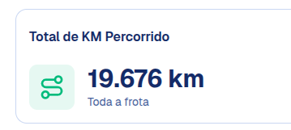 2. 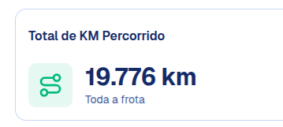 |

### CT-INT-02: Km negativo refletido no dashboard

| Campo | Descrição |
|---|---|
| **Objetivos** | Verificar como o indicador "Total de KM Percorrido" no Dashboard reage ao receber um registro de viagem com quilometragem negativa. |
| **Pré-Condição** | O usuário deve estar logado no sistema. O sistema permitindo o cadastro de viagens com KM negativo. Registrar o valor numérico que aparece no card "Total de KM Percorrido" antes de realizar o teste. |
| **Dados Utilizados** | Dados válidos de Veículo, Origem, Destino e Datas. Um valor negativo para a quilometragem (ex: -500). |
| **Passos** | 1. Acessar o Dashboard e anotar o valor atual de KM de toda a frota; 2. Navegar até a tela de "Viagens" e clicar em "+ Nova Viagem"; 3. Preencher o formulário, inserindo o valor negativo no campo de KM; 4. Clicar em “Adicionar”; 5. Retornar à tela principal; 6. Observar o valor atualizado no card "Total de KM Percorrido"; |
| **Resultados Esperados** | Considerando que o sistema falhou ao barrar o KM negativo no cadastro, a integração com o Dashboard idealmente deveria ter uma tratativa para não subtrair esse valor do total da frota. |
| **Resultados Obtidos** | O Dashboard não possui tratativa para o erro do cadastro, subtraindo 500 km do total geral da frota e tornando a métrica gerencial incorreta. |
| **Status** | Reprovado. |
| **Evidências** | 1.  2. 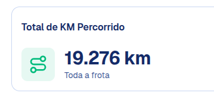 |

### CT-INT-03: Manutenção em outubro reflete na Projeção Financeira

| Campo | Descrição |
|---|---|
| **Objetivo** | Validar se o cadastro de uma nova manutenção programada para o mês de Outubro de 2026 atualiza corretamente o card de "Projeção Financeira" no Dashboard, refletindo tanto o valor financeiro quanto a contagem de manutenções. |
| **Pré-Condição** | O usuário precisa estar logado no sistema. O card de Projeção Financeira no Dashboard deve estar exibindo os valores iniciais para Outubro 2026, com "R\$ 0,00" de custo total estimado e "0 manutenções no mês". |
| **Dados Utilizados** | Dados válidos para Veículo e Serviço na tela de Manutenção. Data de Início e/ou Finalização obrigatoriamente dentro do mês de Outubro (ex: 15/10/2026). Um valor positivo para o Custo Estimado. |
| **Passos** | 1. Acessar a tela inicial e confirmar que a Projeção Financeira para Outubro 2026 está zerada; 2. Navegar pelo menu lateral até a tela de "Manutenção". 3. Preencher o formulário, garantindo que as datas pertençam ao mês de Outubro de 2026. 4. Inserir o valor do custo estimado (ex: R\$ 500,00) e salvar o registro. 5. Retornar à tela principal (Dashboard) e observar novamente o card "Projeção Financeira". |
| **Resultados Esperados** | O sistema deve somar o custo da manutenção recém-criada, alterando o valor do card de "R\$ 0,00" para "R\$ 500,00". E o indicador de quantidade deve mudar de "0 manutenções no mês" para "1 manutenção no mês". |
| **Resultados Obtidos** | O card atualizou instantaneamente os valores em R\$ e a quantidade de manutenções cadastradas para o mês de Outubro de 2026, validando a integração entre os módulos. |
| **Status** | Aprovado. |
| **Evidências** | 1. 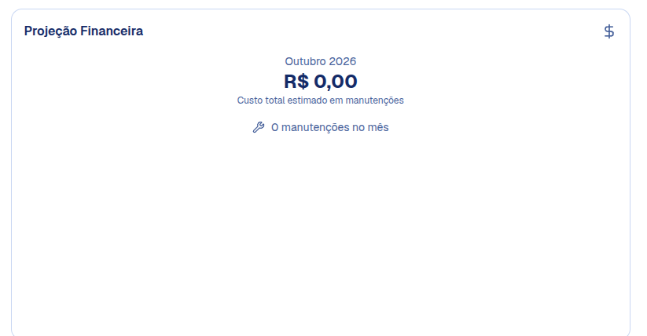 2. 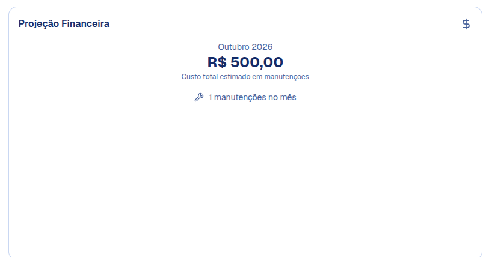 |
