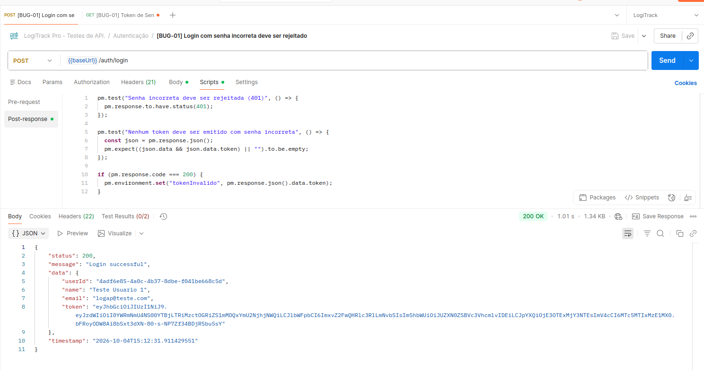
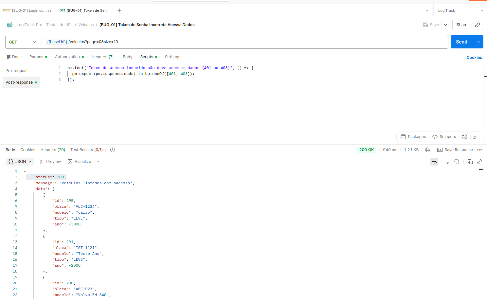
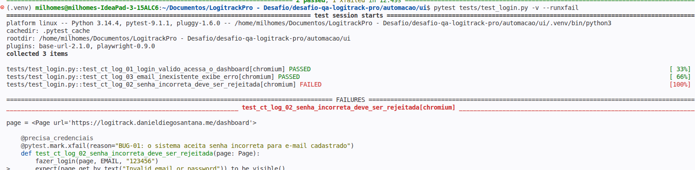
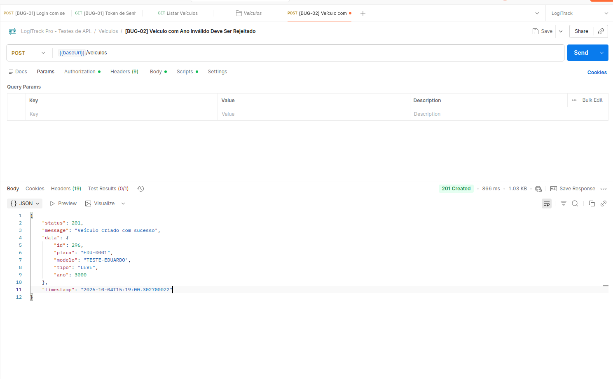
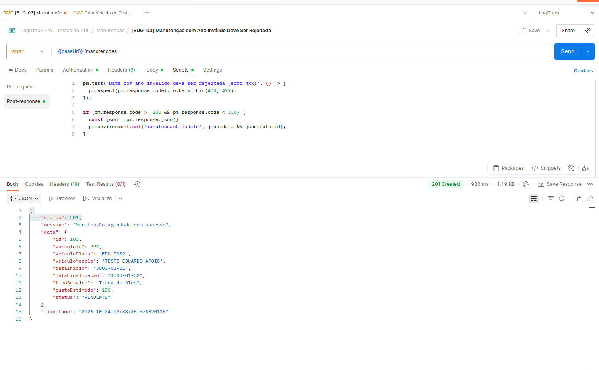
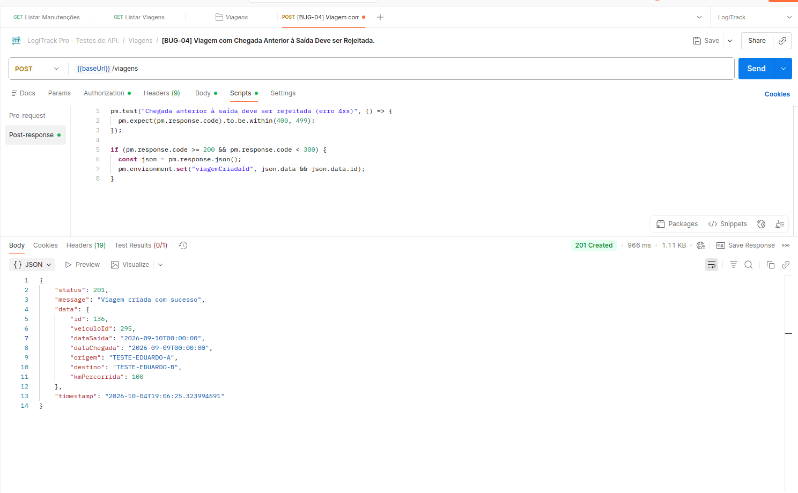
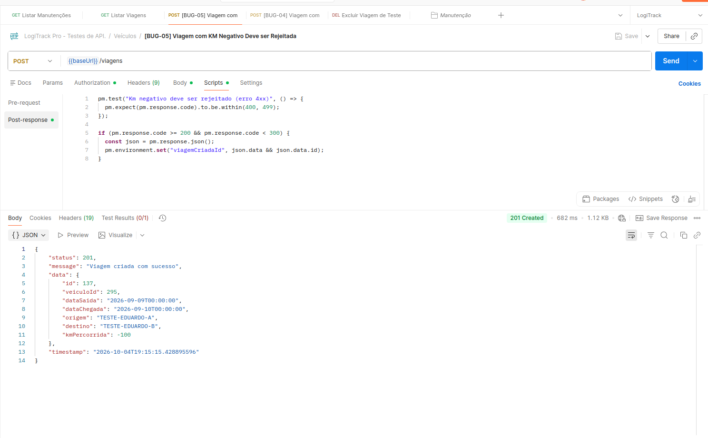
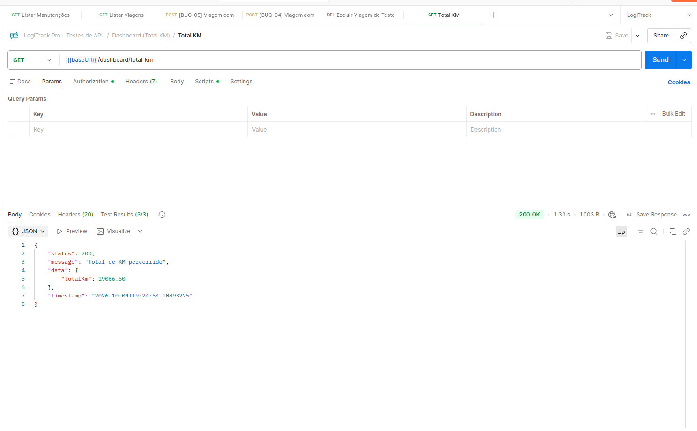
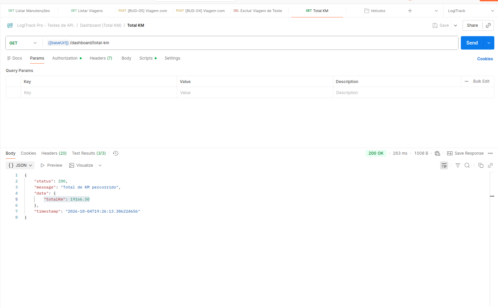
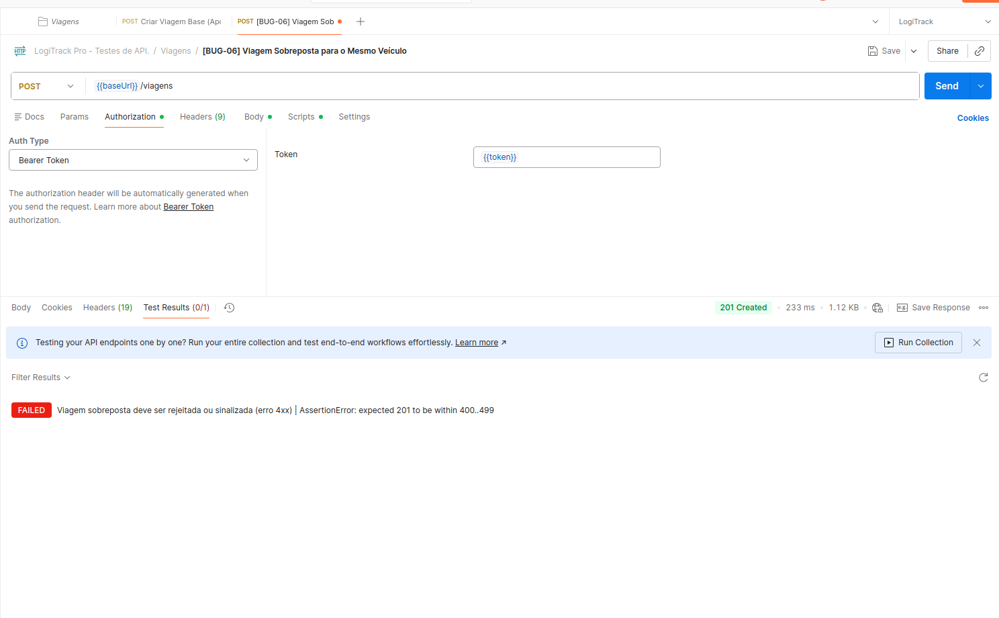

# Relatório de Bugs

Defeitos encontrados durante a execução dos cenários de teste do LogiTrack Pro (ver `01-cenarios-de-teste.md`). Para cada bug são apresentados o problema encontrado, o impacto e as condições necessárias para reproduzi-lo. Os dados de reprodução (pré-condições, dados, passos, resultado esperado e obtido) são os mesmos registrados nos cenários de origem. Os bugs também foram reproduzidos diretamente na API e, no caso do BUG-01, por um teste automatizado de interface (ver `05-diferenciais.md`).

## Resumo

| ID | Título | Cenário(s) de origem | Tela | Severidade | Status |
|---|---|---|---|---|---|
| BUG-01 | Login aceita qualquer senha para e-mail cadastrado | CT-LOG-02 | Login | Crítica | Aberto |
| BUG-02 | Cadastro de veículo aceita ano inválido | CT-VEI-03 | Veículos | Média | Aberto |
| BUG-03 | Cadastro de manutenção aceita ano inválido nas datas | CT-MAN-01 | Manutenção | Média | Aberto |
| BUG-04 | Viagem aceita data de chegada anterior à data de saída | CT-VIA-01 | Viagens | Alta | Aberto |
| BUG-05 | Viagem aceita quilometragem negativa e o Dashboard subtrai o valor do total da frota | CT-VIA-02 e CT-INT-02 | Viagens e Dashboard | Alta | Aberto |
| BUG-06 | Sistema permite viagens sobrepostas para o mesmo veículo | CT-VIA-03 | Viagens | Média | Aberto |

## Critério de severidade adotado

| Severidade | Critério |
|---|---|
| Crítica | Compromete a segurança ou o controle de acesso ao sistema |
| Alta | Aceita dado inválido em fluxo central e compromete a confiabilidade das informações ou dos indicadores de gestão |
| Média | Aceita dado inválido ou viola regra de negócio sem impacto imediato comprovado nos indicadores |
| Baixa | Problema cosmético ou de texto, sem efeito na operação |

## Detalhamento dos bugs

### BUG-01: Login aceita qualquer senha para e-mail cadastrado

| Campo | Descrição |
|---|---|
| **Cenário de origem** | CT-LOG-02 (contraste com CT-LOG-03, aprovado) |
| **Tela / Funcionalidade** | Login |
| **Severidade** | Crítica |
| **Descrição do problema** | Ao informar um e-mail cadastrado com uma senha incorreta, o sistema autentica o usuário, redireciona para o Dashboard e não exibe nenhuma mensagem de erro. Com e-mail inexistente, o bloqueio funciona normalmente (CT-LOG-03: mensagem "Invalid email or password"). Durante a execução, qualquer senha incorreta digitada com o e-mail cadastrado permitiu o acesso. |
| **Impacto** | Falha crítica de autenticação: quem conhecer um e-mail cadastrado acessa o sistema sem saber a senha. Após o acesso indevido, o Dashboard carregou os dados da frota (Total de KM, Volume por Categoria, Cronograma de Manutenção, Ranking de Utilização e Projeção Financeira), expondo informações operacionais e financeiras. Como a requisição de login retornou status 200, a falha parece estar na validação feita pela API e não apenas na interface (hipótese a confirmar pela equipe de desenvolvimento). |
| **Pré-condições** | Usuário previamente cadastrado (credenciais fornecidas no desafio); sistema acessível pela URL do desafio. |
| **Dados utilizados** | E-mail: logap@teste.com Senha: 123456 |
| **Passos para reproduzir** | 1. Abrir a URL da aplicação; 2. Verificar que a tela de login é exibida; 3. Preencher o campo "E-mail" com o e-mail informado; 4. Preencher o campo "Senha" com a senha inválida; 5. Clicar no botão "Entrar"; |
| **Resultado esperado** | O sistema não autentica o usuário e aparece uma mensagem de erro informando ao usuário que uma das suas credenciais estão incorretas. |
| **Resultado obtido** | O sistema autenticou o usuário e redirecionou para o Dashboard. Não apareceu nenhuma mensagem de erro. A requisição de login retornou status 200. |
| **Evidências** | 1.  2.  |
| **Reprodução na API** | Reproduzido diretamente na API: o login com senha incorreta retornou 200 com a mensagem "Login successful" e emitiu um token, e esse token acessou a listagem de veículos. Também reproduzido por teste automatizado de interface: após o login com senha incorreta, o sistema leva ao Dashboard. 1.  2.  3.  |
| **Sugestão de correção** | Validar a senha no servidor antes de emitir a sessão ou o token de acesso e retornar erro de credenciais inválidas (status 401). Cobrir com teste automatizado de API e de interface. |

### BUG-02: Cadastro de veículo aceita ano inválido

| Campo | Descrição |
|---|---|
| **Cenário de origem** | CT-VEI-03 |
| **Tela / Funcionalidade** | Veículos > Adicionar Veículo |
| **Severidade** | Média |
| **Descrição do problema** | O campo "Ano" do formulário de veículo não é validado: um ano impossível (ex.: 3000) foi aceito, o veículo foi cadastrado e o sistema exibiu uma mensagem de confirmação. |
| **Impacto** | A base passa a conter veículos com ano de fabricação impossível, o que compromete a confiabilidade do cadastro e de qualquer informação que dependa dessa data. Na listagem de Veículos foram observados registros com anos como -2000, -2020 e 3001, o que indica que o problema não é isolado. |
| **Pré-condições** | O usuário precisa estar logado e na tela de "Veículos". |
| **Dados utilizados** | Dados válidos para Placa, Modelo e Tipo. Um dado inválido para o campo Ano (ex.: 3000). |
| **Passos para reproduzir** | 1. Clicar no botão "+ Adicionar Veículo". 2. Preencher os campos do formulário. 3. No campo "Ano", digitar um valor inválido (ex: 3000). 4. Clicar no botão “Criar”. |
| **Resultado esperado** | O sistema não deve permitir que o cadastro seja concluído e apareça uma mensagem de erro. |
| **Resultado obtido** | O sistema cadastrou o veículo com ano inválido e apareceu uma mensagem de confirmação. |
| **Evidências** | 1.  2.  |
| **Reprodução na API** | Reproduzido diretamente na API: o cadastro de veículo com ano 3000 retornou 201 Created.  |
| **Sugestão de correção** | Limitar o campo a um intervalo realista (por exemplo, do primeiro ano de fabricação aceito até o ano atual + 1), com mensagem de erro clara, no formulário e na API. |

### BUG-03: Cadastro de manutenção aceita ano inválido nas datas

| Campo | Descrição |
|---|---|
| **Cenário de origem** | CT-MAN-01 |
| **Tela / Funcionalidade** | Manutenção > Nova Manutenção |
| **Severidade** | Média |
| **Descrição do problema** | Os campos "Data Início" e "Finalização" aceitam datas com anos absurdos (ex.: 01/01/3000). O sistema salvou a manutenção e exibiu a mensagem de confirmação, sem alertar sobre a data. |
| **Impacto** | Manutenções com datas impossíveis entram na base sem nenhum alerta. Como as datas alimentam o Cronograma de Manutenção e a Projeção Financeira do Dashboard (no CT-INT-03 a projeção do mês foi atualizada pela data da manutenção), datas incorretas podem distorcer o planejamento e a projeção de custos. |
| **Pré-condições** | O usuário precisa estar logado e ter navegado até a tela de "Manutenção". |
| **Dados utilizados** | Dados válidos para Veículo, Serviço, Custo Est. e Status. Uma data com ano inválido para "Data Início" ou "Finalização (ex.: 1800 e 3500). |
| **Passos para reproduzir** | 1. Clicar no botão "+ Nova Manutenção". 2. Preencher os campos de veículo, serviço e custo estimado com informações válidas. 3. No campo de "Data Início" ou "Finalização", digitar uma data contendo um ano inválido (ex: 01/01/3000). 4. Clicar no botão para “Criar”. |
| **Resultado esperado** | O sistema deve impedir que a manutenção seja salva. Uma mensagem de erro deve aparecer alertando que o ano ou a data inserida não é permitida. |
| **Resultado obtido** | O sistema não impediu que a manutenção fosse salva e apareceu uma mensagem de confirmação de manutenção. |
| **Evidências** | 1.  2.  |
| **Reprodução na API** | Reproduzido diretamente na API: o cadastro de manutenção com datas no ano 3000 retornou 201 Created. O teste usou um veículo sem manutenção ativa, porque a API recusa (409) uma segunda manutenção ativa para o mesmo veículo.  |
| **Sugestão de correção** | Definir um intervalo de datas permitido (por exemplo, limitar o ano a uma janela razoável em torno do ano atual) e validar também a ordem entre início e finalização, no formulário e na API. |

### BUG-04: Viagem aceita data de chegada anterior à data de saída

| Campo | Descrição |
|---|---|
| **Cenário de origem** | CT-VIA-01 |
| **Tela / Funcionalidade** | Viagens > Nova Viagem |
| **Severidade** | Alta |
| **Descrição do problema** | O formulário de viagem não compara "Data Saída" e "Data Chegada". Com saída em 10/09/2026 e chegada em 09/09/2026, o sistema cadastrou a viagem e exibiu "Viagem agendada com sucesso". |
| **Impacto** | Viagens com duração negativa passam a existir no histórico e são apresentadas como válidas, comprometendo a confiabilidade dos dados de operação e de qualquer análise de tempo de entrega. Foi observado na listagem um registro com esse padrão (VCJ2S35, Natal - Joao Pessoa, saída 10/09/2026 e chegada 09/09/2026). |
| **Pré-condições** | O usuário deve estar logado e com a tela de "Viagens" aberta. |
| **Dados utilizados** | Valores válidos para os campos Veículo, Origem, Destino e Quilometragem Percorrida (KM). Uma "Data Saída" específica (ex: 10/09/2026). Uma "Data Chegada" que seja anterior à data de saída (ex: 09/09/2026). |
| **Passos para reproduzir** | 1. Na tela de Viagens, clicar no botão "+ Nova Viagem"; 2. No modal "Adicionar Viagem", selecionar um veículo e preencher a Origem, Destino e Quilometragem com dados quaisquer. 3. No campo "Data Saída", inserir a data escolhida; 4. No campo "Data Chegada", inserir uma data anterior à data de saída; 5. Clicar no botão “Adicionar” para salvar; |
| **Resultado esperado** | O sistema não deve permitir o cadastro da viagem. O modal deve continuar aberto e a tela deve exibir uma mensagem de erro. |
| **Resultado obtido** | O sistema permitiu o cadastro da viagem e apareceu uma mensagem de confirmação: “Viagem agendada com sucesso”. |
| **Evidências** | 1.  2.  |
| **Reprodução na API** | Reproduzido diretamente na API: o cadastro de viagem com chegada anterior à saída retornou 201 Created.  |
| **Sugestão de correção** | Exigir que a data de chegada seja igual ou posterior à data de saída, bloqueando o envio com mensagem clara, no formulário e na API. |

### BUG-05: Viagem aceita quilometragem negativa e o Dashboard subtrai o valor do total da frota

| Campo | Descrição |
|---|---|
| **Cenários de origem** | CT-VIA-02 (causa: falta de validação) e CT-INT-02 (impacto no Dashboard) |
| **Tela / Funcionalidade** | Viagens > Nova Viagem e Dashboard > Total de KM Percorrido |
| **Severidade** | Alta |
| **Descrição do problema** | O campo "Quilometragem Percorrida (KM)" aceita valores negativos (ex.: -200) e o sistema salva a viagem com a mensagem "Viagem agendada com sucesso". O Dashboard não trata esse caso e soma o valor negativo ao total. |
| **Impacto** | Na execução do CT-INT-02, o card "Total de KM Percorrido" teve 500 km subtraídos do total da frota, tornando incorreta a métrica gerencial. Um único registro inválido já altera o indicador consolidado da frota. Na listagem de viagens foram observados registros com -286 km e -525 km. |
| **Pré-condições** | **CT-VIA-02:** O usuário precisa estar autenticado e na tela de "Viagens".  **CT-INT-02:** O usuário deve estar logado no sistema. O sistema permitindo o cadastro de viagens com KM negativo. Registrar o valor numérico que aparece no card "Total de KM Percorrido" antes de realizar o teste. |
| **Dados utilizados** | **CT-VIA-02:** Informações válidas para Veículo, Origem, Destino, Data Saída e Data Chegada. Um valor negativo para o campo de quilometragem (ex: -200).  **CT-INT-02:** Dados válidos de Veículo, Origem, Destino e Datas. Um valor negativo para a quilometragem (ex: -500). |
| **Passos para reproduzir** | **Cadastro (CT-VIA-02):** 1. Clicar no botão “+ Nova Viagem”; 2. No modal "Adicionar Viagem", selecionar um veículo e preencher a Origem, Destino e as Datas com dados válidos; 3. No campo "Quilometragem Percorrida (KM)", digitar um valor negativo; 4. Clicar no botão "Adicionar" para tentar salvar o registro.  **Impacto no Dashboard (CT-INT-02):** 1. Acessar o Dashboard e anotar o valor atual de KM de toda a frota; 2. Navegar até a tela de "Viagens" e clicar em "+ Nova Viagem"; 3. Preencher o formulário, inserindo o valor negativo no campo de KM; 4. Clicar em “Adicionar”; 5. Retornar à tela principal; 6. Observar o valor atualizado no card "Total de KM Percorrido"; |
| **Resultado esperado** | **CT-VIA-02:** O sistema não deve processar o cadastro da viagem. A tela deve sinalizar um erro, exibindo uma mensagem informando que o valor deve ser maior que zero  **CT-INT-02:** Considerando que o sistema falhou ao barrar o KM negativo no cadastro, a integração com o Dashboard idealmente deveria ter uma tratativa para não subtrair esse valor do total da frota. |
| **Resultado obtido** | **CT-VIA-02:** O sistema processa o cadastro da viagem mesmo com o valor da quilometragem sendo negativo, exibindo uma mensagem de confirmação: “Viagem agendada com sucesso”.  **CT-INT-02:** O Dashboard não possui tratativa para o erro do cadastro, subtraindo 500 km do total geral da frota e tornando a métrica gerencial incorreta. |
| **Evidências** | 1.  2.  3.  4.  |
| **Reprodução na API** | Reproduzido diretamente na API: o cadastro de viagem com km -100 retornou 201 Created, e o total de km do Dashboard passou de 19066.50 (com a viagem) para 19166.50 (depois de excluí-la), o que comprova que o valor negativo foi subtraído do total. 1.  2.  3.  |
| **Sugestão de correção** | Aceitar apenas valores maiores que zero no campo de quilometragem (formulário e API) e, como defesa adicional, ignorar ou sinalizar registros inválidos no cálculo dos indicadores do Dashboard. |

### BUG-06: Sistema permite viagens sobrepostas para o mesmo veículo

| Campo | Descrição |
|---|---|
| **Cenário de origem** | CT-VIA-03 |
| **Tela / Funcionalidade** | Viagens > Nova Viagem |
| **Severidade** | Média |
| **Descrição do problema** | Foi possível cadastrar uma nova viagem para um veículo que já possuía outra viagem no mesmo período (ADF-1565, entre 29/09/2026 e 30/09/2026). O sistema não bloqueou e exibiu "Viagem agendada com sucesso". |
| **Impacto** | Um mesmo veículo passa a constar em dois trajetos simultâneos, o que é fisicamente inconsistente e pode distorcer a alocação da frota, o total de km e o ranking de utilização. Na listagem foi observado o mesmo padrão (ADF-1565 com Mossoró - Natal e Natal - Recife em 29/09/2026 a 30/09/2026). Observação: a regra não consta no desafio e foi tratada como regra de negócio esperada, que deve ser confirmada com o time de produto. |
| **Pré-condições** | O usuário deve estar autenticado e na tela de "Viagens". Deve existir previamente pelo menos uma viagem cadastrada para um veículo específico. |
| **Dados utilizados** | O mesmo veículo que já possui uma viagem cadastrada (ex.: o veículo ADF-1565 que já tem uma viagem entre 29/09/2026 e 30/09/2026). Dados de Origem, Destino e KM preenchidos com novas informações. Datas de Saída e Chegada que entrem em conflito com a viagem já existente (ex: Saída em 29/09/2026 e Chegada em 30/09/2026). |
| **Passos para reproduzir** | 1. Clicar no botão "+ Nova Viagem"; 2. No modal "Adicionar Viagem", selecionar o veículo que já está em uso naqueles dias; 3. Preencher a Origem, Destino e Quilometragem; 4. Preencher as datas de Saída e Chegada com o período que se sobrepõe à viagem já existente. 5. Clicar no botão "Adicionar" para tentar salvar. |
| **Resultado esperado** | O sistema deve bloquear a criação da viagem. Uma mensagem de erro deve alertar o usuário que o veículo já está alocado para outro trajeto. |
| **Resultado obtido** | O sistema não bloqueou a criação da viagem, exibindo uma mensagem de confirmação: “Viagem agendada com sucesso”. |
| **Evidências** | 1.  2.  |
| **Reprodução na API** | Reproduzido diretamente na API: o cadastro de uma segunda viagem para o mesmo veículo e o mesmo período retornou 201 Created.  |
| **Sugestão de correção** | Antes de salvar, verificar se o veículo já possui viagem no período informado e, se houver, bloquear ou alertar o usuário (a decisão entre bloquear e alertar cabe ao time de produto). |

## Padrão observado

Cinco dos seis bugs (BUG-02 a BUG-06) têm a mesma natureza: o sistema aceita dados inválidos nos formulários e confirma o cadastro, o que sugere ausência de validação centralizada, tanto no formulário quanto na API. O BUG-01 é uma falha de autenticação, independente das demais. Esse padrão é a base da priorização proposta em `03-estrategia-de-testes.md` (testes de API, de segurança e de interface com foco em validação de entradas).

## Observação para quem for reproduzir

Os bugs BUG-02 a BUG-06 criam registros no ambiente de teste. Recomenda-se identificar os dados com um prefixo próprio (ex.: `TESTE-QA`) e excluir ao final apenas os registros criados no teste.
