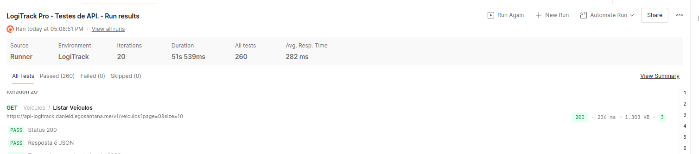
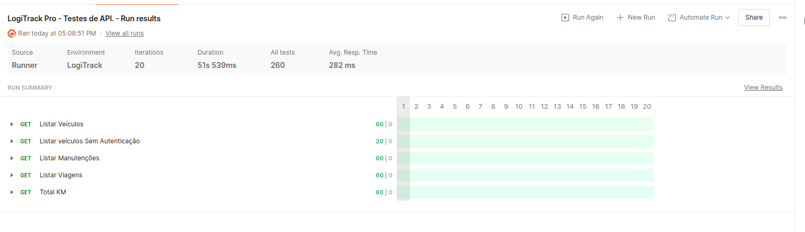

# Diferenciais

Este documento reúne as atividades opcionais realizadas além dos testes manuais obrigatórios (ver `01-cenarios-de-teste.md`, `02-analise-ux.md`, `03-estrategia-de-testes.md` e `04-bugs.md`).

## Testes de API

### Objetivo

Validar diretamente na API (sem passar pela interface) os códigos de resposta, a estrutura das respostas, o controle de acesso e o tratamento de dados inválidos. Os testes também confirmam, no nível do servidor, os bugs encontrados na execução manual.

### Ferramenta e organização

- **Ferramenta:** Postman, com testes escritos em JavaScript na aba de scripts de cada requisição.
- **Coleção:** [`automacao/api/LogiTrack-Pro.postman_collection.json`](../automacao/api/LogiTrack-Pro.postman_collection.json), organizada em pastas (Autenticação, Veículos, Manutenção, Viagens e Dashboard).
- **Variáveis de ambiente:** `baseUrl`, `email` e `password` (configuradas pelo usuário), além de `token`, `tokenInvalido` e identificadores de dados de teste, que são preenchidos pelos próprios scripts. O ambiente não faz parte do repositório, para não expor credenciais.
- **Autenticação:** o login retorna um token, usado como Bearer Token nas demais requisições.

### Endpoints utilizados

Os endereços foram identificados na aba Network do navegador. A base da API é `https://api-logitrack.danieldiegosantana.me/v1`.

| Módulo | Método e caminho | Uso |
|---|---|---|
| Autenticação | POST `/auth/login` | Login válido e login com senha incorreta |
| Veículos | GET `/veiculos?page=0&size=10` | Listagem |
| Veículos | POST `/veiculos` | Cadastro (inclusive com dado inválido) |
| Veículos | DELETE `/veiculos/{id}` | Limpeza dos dados de teste |
| Manutenção | GET `/manutencoes?page=0&size=10` | Listagem |
| Manutenção | POST `/manutencoes` | Cadastro (inclusive com dado inválido) |
| Manutenção | DELETE `/manutencoes/{id}` | Limpeza dos dados de teste |
| Viagens | GET `/viagens?page=0&size=10` | Listagem |
| Viagens | POST `/viagens` | Cadastro (inclusive com dado inválido) |
| Viagens | DELETE `/viagens/{id}` | Limpeza dos dados de teste |
| Dashboard | GET `/dashboard/total-km` | Total de km da frota |

### Estrutura das respostas observada

Estrutura registrada a partir das respostas, como base para testes de contrato.

| Endpoint | Campos observados |
|---|---|
| Login | `status`, `message`, `data` (`userId`, `name`, `email`, `token`) e `timestamp` |
| Veículos | `id`, `placa`, `modelo`, `tipo` (ex.: `LEVE`) e `ano` |
| Manutenção | `id`, `veiculoId`, `veiculoPlaca`, `veiculoModelo`, `dataInicio`, `dataFinalizacao`, `tipoServico`, `custoEstimado` e `status` (ex.: `PENDENTE`) |
| Viagens | `id`, `veiculoId`, `dataSaida`, `dataChegada`, `origem`, `destino` e `kmPercorrida` |

As listagens e os cadastros retornam os dados dentro do campo `data`, junto de `status`, `message` e `timestamp`.

### Resultados

| Requisição | Validação | Resultado esperado | Resultado obtido | Resultado | Bug |
|---|---|---|---|---|---|
| Listar veículos, manutenções e viagens | Status, formato JSON e tempo de resposta (limite adotado de 2000 ms) | 200, JSON e tempo abaixo do limite | 200, JSON e tempo abaixo do limite nas três listagens | Aprovado | - |
| Total de km (Dashboard) | Status, formato JSON e tempo de resposta | 200, JSON e tempo abaixo do limite | 200, JSON e tempo abaixo do limite | Aprovado | - |
| Listar veículos sem autenticação | Acesso sem token | 401 ou 403 | 403 Forbidden | Aprovado | - |
| Login com senha incorreta | Código de resposta e emissão de token | 401, sem token | 200 "Login successful", com token emitido | Reprovado | BUG-01 |
| Listar veículos com o token emitido por senha incorreta | Acesso aos dados | 401 ou 403 | 200, com acesso aos dados | Reprovado | BUG-01 |
| Cadastro de veículo com ano 3000 | Rejeição de dado inválido | Erro 4xx | 201 Created | Reprovado | BUG-02 |
| Cadastro de manutenção com datas no ano 3000 | Rejeição de dado inválido | Erro 4xx | 201 Created | Reprovado | BUG-03 |
| Cadastro de viagem com chegada anterior à saída | Rejeição de dado inválido | Erro 4xx | 201 Created | Reprovado | BUG-04 |
| Cadastro de viagem com km negativo (-100) | Rejeição de dado inválido | Erro 4xx | 201 Created | Reprovado | BUG-05 |
| Total de km antes e depois da viagem com km negativo | Efeito no indicador | Total não alterado por dado inválido | Total de 19066.50 antes da exclusão e 19166.50 depois, ou seja, o valor negativo foi subtraído do total | Reprovado | BUG-05 |
| Cadastro de viagem sobreposta para o mesmo veículo | Rejeição ou sinalização | Erro 4xx | 201 Created | Reprovado | BUG-06 |

Os testes reprovados falham de propósito: eles descrevem o comportamento esperado e passarão quando os bugs forem corrigidos, podendo ser usados como testes de regressão.

### Evidências

**BUG-01: login com senha incorreta**

**BUG-02: veículo com ano inválido**

**BUG-03: manutenção com ano inválido**

**BUG-04: viagem com chegada anterior à saída**

**BUG-05: viagem com km negativo e efeito no total**

**BUG-06: viagem sobreposta**

### Observações

- **Controle de acesso:** sem token, a API negou o acesso aos dados (403), o que é um ponto positivo. O problema está na emissão do token no login (BUG-01).
- **Regra de negócio descoberta:** ao tentar cadastrar uma manutenção para um veículo que já possuía uma manutenção ativa (Pendente ou Em Realização), a API respondeu 409 com a mensagem de que o veículo já possui manutenção ativa. A regra é correta. Esse resultado não serve como prova do BUG-03, porque a recusa não foi causada pelo ano da data. O teste foi refeito com um veículo de teste sem manutenção ativa, e então a API aceitou a data inválida.
- **Validação de campos obrigatórios:** uma requisição de manutenção enviada com o corpo vazio retornou 400 com a mensagem "Validation failed" e a lista dos campos obrigatórios. A API valida a presença dos campos, mas, nos casos testados, não validou o conteúdo (ano, km, datas e sobreposição de viagens).
- **Códigos de resposta:** cadastro retorna 201, exclusão retorna 204 e consulta retorna 200.
- **Limite de tempo de resposta:** o valor de 2000 ms foi adotado por premissa, pois o desafio não define um requisito de desempenho.

### Cuidados com o ambiente de testes

- Cada teste que cria registros foi seguido da exclusão dos dados criados, e todas as exclusões retornaram sucesso. Os dados de teste usaram identificação própria (por exemplo, `TESTE-EDUARDO`).
- Credenciais e tokens não foram incluídos no repositório. A coleção exportada não contém o ambiente.
- Não foram feitos testes de carga, para não sobrecarregar um ambiente compartilhado.

### Como executar

1. Importar a coleção `automacao/api/LogiTrack-Pro.postman_collection.json` no Postman.
2. Criar um ambiente com as variáveis `baseUrl` (`https://api-logitrack.danieldiegosantana.me/v1`), `email` e `password` (credenciais fornecidas no desafio). Marcar a senha como secret.
3. Executar primeiro a requisição de login válido da pasta Autenticação, que grava o `token` usado pelas demais.
4. Executar as requisições uma a uma. As requisições de cadastro com dado inválido criam registros quando o bug está presente, então cada uma deve ser seguida da requisição de exclusão correspondente (as exclusões usam os identificadores gravados pelos scripts).

Não é recomendado executar a coleção inteira de uma só vez pelo Runner, porque os cadastros e as exclusões dependem da ordem.

## Análise de desempenho

### Objetivo

Realizar uma validação básica do tempo de resposta e do comportamento da API sob múltiplas requisições, conforme proposto no desafio.

### Método

- **Ferramenta:** Collection Runner do Postman, executando a coleção de testes de API descrita acima.
- **Requisições:** apenas consultas (GET), para não criar nem alterar dados no ambiente compartilhado: Listar veículos, Listar manutenções, Listar viagens, Total de km (Dashboard) e Listar veículos sem autenticação (como contraste).
- **Execução:** 20 iterações, com intervalo de 200 ms entre as requisições. As requisições foram feitas em sequência, e não de forma simultânea.
- **Critério:** cada listagem foi verificada quanto ao status 200, ao formato JSON e ao tempo de resposta abaixo de 2000 ms. O limite de 2000 ms foi adotado por premissa, pois o desafio não define um requisito de desempenho.
- **Data da execução:** 4 de outubro de 2026.

### Resultados

| Indicador | Valor |
|---|---|
| Iterações | 20 |
| Requisições executadas | 100 (5 requisições em 20 iterações) |
| Duração total | 51 s 539 ms (inclui o intervalo de 200 ms entre as requisições) |
| Testes executados | 260 |
| Testes aprovados | 260 |
| Testes reprovados | 0 |
| Tempo médio de resposta | 282 ms |

Resultado por requisição:

| Requisição | Testes aprovados | Testes reprovados |
|---|---|---|
| Listar veículos | 60 | 0 |
| Listar veículos sem autenticação | 20 | 0 |
| Listar manutenções | 60 | 0 |
| Listar viagens | 60 | 0 |
| Total de km | 60 | 0 |

Como exemplo de uma das chamadas, a listagem de veículos respondeu com status 200 em 236 ms e 1,3 KB.

### Evidências

### Conclusão e limitações

- Nas 80 chamadas de listagem, nenhuma respondeu em mais de 2000 ms, e o tempo médio geral foi de 282 ms. Não foram observadas falhas nem variações de comportamento ao longo das 20 iterações.
- A medição inclui a latência da conexão da máquina utilizada nos testes e foi feita em uma única execução, em um ambiente compartilhado. Os valores servem como referência inicial, e não como garantia de desempenho.
- Esta análise não é um teste de carga, porque as requisições não foram simultâneas. Um teste de carga com volume maior deve ser feito em um ambiente dedicado, para não afetar outros usuários.

### Como executar

1. Executar o login válido da pasta Autenticação, para gravar o `token`.
2. Abrir o Runner a partir da coleção e selecionar apenas as requisições de listagem (GET) e a de Total de km.
3. Configurar 20 iterações e intervalo de 200 ms, e executar.
4. Consultar o tempo médio de resposta e a quantidade de testes aprovados no resumo da execução.
